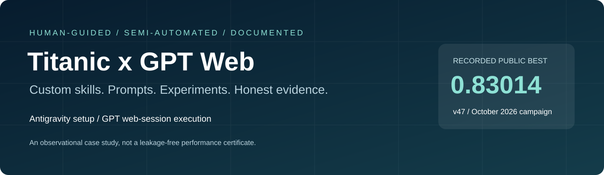
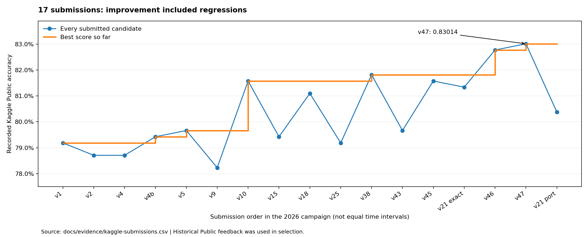
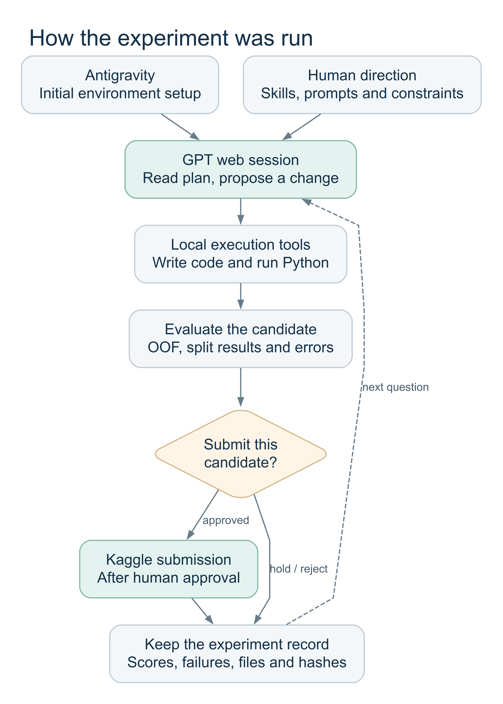

# Kaggle Titanic Experiments

Titanic - Machine Learning from Disaster



Kaggle Notebook: [Titanic 2026 Ensemble Techniques - Public 0.83014](https://www.kaggle.com/code/taeyangg4/titanic-2026-ensemble-techniques-public-0-83014)

[English](README.en.md) / [단계별 실험 기록](docs/02-experiment-journey.md) / [검증과 한계](docs/03-validation-and-integrity.md) / [재현 방법](docs/05-reproduction.md)

## 프로젝트 소개

직접 설정한 스킬과 프롬프트만으로 머신러닝 실험을 얼마나 진행할 수 있는지 확인하려고 시작했다. Titanic 데이터를 대상으로 피처를 만들고, 모델을 비교하고, 결과가 좋지 않으면 원인을 다시 살피는 과정을 기록했다.

초기 환경 설정은 Antigravity에서 진행했다. 이후 가설 수립, 코드 작성, 실행 지시, 결과 분석과 문서 정리는 GPT 웹 세션을 통해 수행했다. 계산은 연결된 로컬 Python 환경에서 실행했고, 실험 방향과 제출 여부는 대화 중에 직접 결정했다. 완전 자동화보다는 사람이 판단하고 GPT가 실행을 이어가는 방식이었다.

처음 제출한 점수는 0.79186, 마지막에 선택한 v47은 0.83014였다. 총 17번 제출했으며, 잘된 실험뿐 아니라 점수가 떨어진 후보와 보류한 방법도 남겼다.

## 결과

| 항목 | 기록 |
|---|---|
| 최초 제출 | v1, Public 0.79186 |
| 최고 제출 | v47, Public 0.83014 |
| 표시 점수 기준 상승 폭 | 0.03828, 약 3.83%p |
| 기준 앙상블 v5 | OOF 0.85410, Public 0.79665 |
| 티켓 P3 연구 후보 | bagged OOF 0.85971, 제출 Public 0.79665 |
| 실제 제출 수 | 17건, 2026년 10월 4~5일 UTC |
| 최종 제출 ID | 56841675 |

수치는 [제출 기록](docs/evidence/kaggle-submissions.csv)과 [보존한 평가 결과](exports/v44/summary.csv)에서 확인할 수 있다. v1부터 v47까지의 번호는 작업 버전이며 독립 실험 47회를 뜻하지 않는다.



처음에는 치팅이나 정답 조회, 데이터 누출 없이 개선하는 것을 목표로 했다. 실제 기록에는 전체 학습 라벨로 관계 통계를 만든 뒤 CV를 진행한 재현 코드와 공개 노트북 예측을 사용한 분기가 포함되어 있다. 최종 후보를 고를 때도 Public 결과를 참고했다. 따라서 0.83014는 이 과정에서 얻은 제출 점수이며, 별도로 검증된 무누출 일반화 성능은 아니다. 해당 부분은 [검증과 한계](docs/03-validation-and-integrity.md)에 정리했다.

## 외부 공개 노트북 비교군

현재 프로젝트의 Public 점수를 해석할 때 참고할 수 있도록, Kaggle에 공개된 0.80 이상 노트북 중 누출 여부를 따로 확인할 가치가 있는 사례를 비교군으로 남긴다. 아래 점수는 각 Kaggle 노트북 페이지에 표시된 Public/Best Score이며, 이 저장소에서 동일 환경으로 재현한 값이 아니다. 또한 `clean 후보`는 독립 인증을 뜻하지 않고, 공개 설명과 확인 가능한 입력 범위에서 우선 비교 대상으로 삼는다는 의미다.

| 공개 노트북 | 표시 점수 | 비교 상태 | 메모 |
|---|---:|---|---|
| [Yoni Krichevsky - Top 3% with only 4 features - no data leakage](https://www.kaggle.com/code/yoni2k/top-3-with-only-4-features-no-data-leakage) | 0.81818 | clean 우선 후보 | 노트북이 `no data leakage`를 명시하고 Kaggle 페이지에 input 1 file로 표시된다. 별도 전체 코드 감사 전이므로 무누출을 독립 인증한 것은 아니다. |
| [Jonathan Oheix - Titanic survivors prediction - TOP 5%](https://www.kaggle.com/code/jonathanoheix/titanic-survivors-prediction-top-5) | 0.82296 | 감사 보류 | Kaggle 페이지에서 input 1 file과 점수는 확인되지만, family/ticket target-derived feature 여부를 포함한 전체 코드 감사를 끝내지 않았다. |
| [Chris Deotte - Titanic Deep Net [0.82296]](https://www.kaggle.com/code/cdeotte/titanic-deep-net-0-82296) | 0.82296 | 감사 보류 | competition input을 쓰는 R 노트북이다. 점수는 확인되지만 strict leakage 기준의 전체 코드 감사 전에는 clean 비교군으로 확정하지 않는다. |
| [Titanic competition w/ TensorFlow Decision Forests](https://www.kaggle.com/code/gusthema/titanic-competition-w-tensorflow-decision-forests) | 0.80143 | 보수적 baseline | Kaggle competition의 train/test/gender submission 입력을 사용하는 pinned notebook이다. 고득점 상한 후보라기보다 재현 가능한 외부 baseline으로 둔다. |

따라서 현재 문서에서 가장 강하게 clean 비교 대상으로 둘 수 있는 공개 점수는 0.81818이고, 0.82296 두 사례는 코드 감사 대기 후보로 취급한다. 이 비교표는 v47의 0.83014를 무누출 점수로 승격하지 않으며, 오히려 서로 다른 정보 경계의 점수를 분리해서 보기 위한 것이다. 자세한 출처와 판정 메모는 [참고 자료](docs/07-references.md)에 정리했다.

## 작업 방식

기존 계획과 로그를 읽고 다음 가설을 정한 뒤, 로컬 도구로 코드를 실행했다. 점수만 비교하지 않고 어떤 승객의 예측이 달라졌는지, 다른 seed에서도 결과가 유지되는지 함께 확인했다. 제출이 필요할 때는 파일 검사와 승인을 거쳤다.

<p align="center">
  
</p>

[흐름도 원본](docs/diagrams/workflow.dot) / [확대 보기](docs/assets/workflow.svg)

스킬은 이 순서를 지키고 결과를 남기기 위한 작업 규약으로 사용했다. 모델에 프롬프트를 입력해 생존 여부를 맞힌 것은 아니다. 실제 지시 예시와 자동화 범위는 [운영 방식](docs/04-workflow-and-prompts.md)에 있다.

## 어떻게 개선했나

### 기준선과 피처 정리

처음에는 여섯 종류의 트리 모델이 낸 생존 확률을 평균했다. 이름에서 호칭을 추출하고, `SibSp + Parch + 1`로 가족 크기를 계산하고, 같은 티켓을 공유하는 사람 수를 추가했다. v2에서는 티켓 공유 인원으로 요금을 나눈 피처도 넣었지만 Public은 0.78708로 내려갔다. 피처를 추가하는 것과 실제 점수가 오르는 것은 별개였다.

가족이나 티켓의 생존 정보를 쓰는 과정에서는 검증 라벨이 통계에 섞일 수 있었다. 이후 관계 피처를 fold의 학습 라벨로 다시 계산하는 비교를 추가해 피처 효과와 평가 누출을 구분하려 했다.

### 다른 방식으로 틀리는 모델 결합

v4b에서는 기존 트리 확률에 TabICLv2를 10%만 섞었다. Public은 0.79425였다. v5는 여기에 RuleFit과 MLP-PLR을 추가해 세 멤버의 다수결을 사용했다. MLP는 seed 하나의 결과를 그대로 쓰지 않고 42, 142, 242의 확률을 평균했다. 이 구성은 Public 0.79665를 기록했고 이후 비교 기준으로 남았다.

스태킹도 시험했지만, 기록된 비교에서는 AUC가 좋아져도 Accuracy가 함께 오르지 않았다. 그래서 모델을 더 복잡하게 쌓기보다 기존 모델이 틀리는 부분을 다른 모델이 실제로 보완하는지 살폈다.

### 공개 방법 재현과 관계 피처

Gunes 방식에서는 나이와 요금을 분위수로 나누고 Deck를 묶었으며, 가족과 티켓의 생존 통계를 사용했다. 이를 재현한 v10의 Public은 0.81578이었다. 다만 전체 라벨로 미리 계산한 피처가 CV에도 들어갔기 때문에 원본 OOF를 무누출 비교 점수로 사용하지 않았다.

이후 여성과 아이, 성인 남성의 관계 통계를 나눈 `typed22`, 작은 그룹의 통계를 평균 쪽으로 줄이는 EB 보정, Deotte의 WCG 규칙을 비교했다. 검증도 고정 fold에서 반복 CV, 그룹 분리, 실제 test와 관계 비율이 비슷한 holdout으로 확대했다.

### 반복 오답에서 새 피처 찾기

같은 승객을 계속 틀리는 이유를 살피면서 Name, Ticket, Cabin을 문자 n-gram으로 학습했다. 단독 모델은 약했지만 일부 다른 오답을 맞혔다. 여기서 숫자 티켓의 앞 세 자리를 묶는 P3 피처를 추가로 시험했다. P3는 여러 로컬 비교에서 좋아졌지만 전체 제출 후보의 Public은 0.79665에 그쳤다.

### 최종 제출 조합

마지막에는 v10 전체를 새 모델로 교체하지 않고 일부 예측에만 보정을 적용했다. 텍스트 모델이 높은 확신으로 반대하는 경우를 반영한 v38은 0.81818이었다. 여기에 좁은 WCG 여성 규칙을 적용한 v46은 0.82775, 더 넓은 Deotte 여성 예측을 적용한 v47은 0.83014였다.


[흐름도 원본](docs/diagrams/final-lineage.dot) / [확대 보기](docs/assets/final-lineage.svg)

v46과 v47은 둘 다 v38에서 출발한다. v47에서 바꾼 13개 예측에는 v46의 4개가 포함되므로 두 변경 수를 더하면 안 된다. 점선은 v46의 제출 결과가 이후 선택에 영향을 줬다는 뜻이다. 최종 v47에는 별도로 평가한 독립 OOF 점수가 없다.

피처 계산식, 모델 설정, 전후 수치와 실패한 이유는 [단계별 실험 기록](docs/02-experiment-journey.md)에 자세히 정리했다.

## 문서 안내

| 문서 | 내용 |
|---|---|
| [실험 설계](docs/01-experiment-design.md) | 목적, 역할, 측정한 것과 측정하지 못한 것 |
| [단계별 실험 기록](docs/02-experiment-journey.md) | 변경 이유, 코드, 평가 방식, 결과와 다음 결정 |
| [검증과 한계](docs/03-validation-and-integrity.md) | 누출 위험, 공개 예측 사용, 반복 검증과 Public 선택 |
| [운영 방식](docs/04-workflow-and-prompts.md) | 스킬과 프롬프트의 역할, 실제 지시 예시 |
| [재현 방법](docs/05-reproduction.md) | 데이터 준비, 환경, 파일 검증, 최종 예측 재조립 |
| [결과와 교훈](docs/06-results-and-lessons.md) | 실험에서 배운 점과 후속 과제 |
| [참고 자료](docs/07-references.md) | 공개 방법과 원저자, 라이브러리 문서 |

## 파일 구성

```text
docs/                        실험 보고서
  assets/                    점수 차트와 흐름도 이미지
  diagrams/                  흐름도 소스와 파일 해시
  evidence/                  제출 기록, 환경과 데이터 지문
scripts/                     당시 실행한 실험 코드
notebooks/                   출력을 제거한 학습 노트북
exports/                     지표, OOF와 설정 기록
submissions/                 예측 CSV
tools/                       문서 이미지 생성과 파일 검증
archive/                     과거 연습 자료와 작업 노트
data/                        공식 데이터 다운로드 안내
```

원본 Kaggle 데이터, 인증 파일과 모델 체크포인트는 포함하지 않았다. 실험 코드는 당시 상태를 보존했고, 문서화하면서 수치를 바꾸거나 과거 코드를 수정한 뒤 옛 점수를 붙이지 않았다.

## 재현

```bash
git clone https://github.com/TaeyanG4/kaggle-titanic-experiments.git
cd kaggle-titanic-experiments
python tools/verify_publication.py
python tools/replay_final_artifact.py --output replayed_v47.csv
```

첫 번째 도구는 파일과 링크를 검사하고, 두 번째 도구는 보존된 예측을 조합해 최종 CSV를 다시 만든다. 원시 데이터부터 모델을 재학습하는 명령은 아니다. 재학습에 필요한 조건은 [재현 문서](docs/05-reproduction.md)에 있다.

실험은 종료했다. 추가 학습이나 자동 제출은 실행하지 않는다. 재사용 조건은 [NOTICE](NOTICE.md)를 참고하면 된다.
