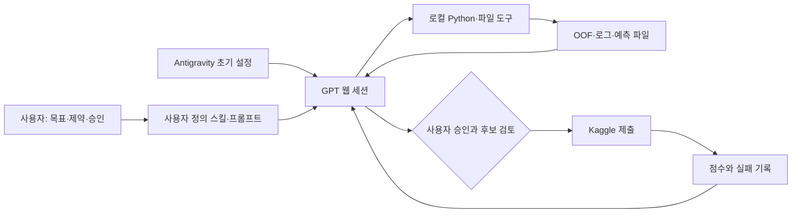
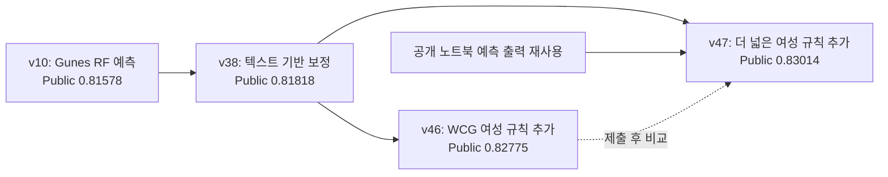

# Kaggle Titanic Experiments

**Titanic — Machine Learning from Disaster**

피처 엔지니어링·앙상블·검증·실패 분석을 기록한 반자동 머신러닝 실험 프로젝트입니다.


[English overview](README.en.md) · [상세 실험 여정](docs/02-experiment-journey.md) · [검증·출처·한계](docs/03-validation-and-integrity.md) · [재현 안내](docs/05-reproduction.md)

## 이 저장소가 기록하는 것

이 저장소의 중심 질문은 **“사용자가 설계한 스킬과 프롬프트를 활용해, GPT 웹 세션으로 Titanic 머신러닝 실험을 어디까지 진행할 수 있는가?”**입니다. 저장소명은 대회와 실험 기록을 나타내고, 사용한 도구와 사람의 역할은 아래 방법 설명에서 구분합니다.

이 프로젝트는 Titanic 최고점 자체보다 **사용자 정의 스킬과 자연어 프롬프트를 이용한 반자동 데이터 과학 작업의 가능성과 한계**를 관찰하기 위한 개인 실험입니다. 소유자의 설명에 따르면 초기 환경 설정은 Antigravity에서 진행했고, 이후 실험 설계·코드 작성·실행 지시·결과 분석·문서화는 GPT 웹 세션을 통해 수행했습니다. 웹 세션은 로컬 파일·실행 도구와 Kaggle CLI에 연결되어 있었습니다. 사람이 목표와 제약을 정하고, 중간 결과를 질문·검토하고, 제출 여부를 승인했습니다. 완전 자율 AutoML이나 통제된 모델 간 벤치마크가 아닙니다.

**실험 의도는 치팅이나 정답 조회, 의도적인 데이터 누출 없이 개선하는 것이었습니다.** 다만 최종 정리에서 확인한 코드에는 누출 위험이 있는 역사적 재현 분기, 공개 노트북의 개별 예측 재사용, Public 점수를 확인한 뒤의 후보 선택이 포함됩니다. 따라서 **최고 Public 0.83014를 엄밀한 무누출 일반화 성능으로 홍보하지 않습니다.** 목표와 실제 구현을 구분한 [무결성 보고서](docs/03-validation-and-integrity.md)를 먼저 읽어주세요.

## 결과 한눈에 보기

| 구분 | 기록된 값 | 의미 |
|---|---:|---|
| 이번 2026 캠페인 최초 제출 | **0.79186** | v1, Submission 56824542 |
| 최고 Public 제출 | **0.83014** | v47, Submission **56841675** |
| 최초 대비 표시 점수 개선 | **+0.03828** | 약 **3.83%p**; 상대 증가율과 다름 |
| 보존한 기준 모델 v5 | OOF **0.85410** / Public **0.79665** | 당시 그룹 타깃 피처의 fold 경계를 감사한 기준점 |
| P3 bagged 연구 후보 | 보고된 OOF **0.85971** / 제출 Public **0.79665** | 로컬 개선과 제출 개선의 불일치를 보여주는 사례 |
| 이 캠페인의 실제 제출 | **17건** | 2026-10-04~05 UTC 제출 기록; 2023년 연습 제외 |
| 실험 식별자 범위 | **v1~v47** | 버전 번호이며, 47개의 동등·독립 실험을 뜻하지 않음 |

근거: [Kaggle 제출 영수증](docs/evidence/kaggle-submissions.csv), [v44 평가](exports/v44/summary.csv), [제출 파일 해시 목록](docs/evidence/submission-manifest.json). 종료 시점 기록이며, 실시간 순위나 상위 백분위는 주장하지 않습니다.


실험 진행이 매번 성공한 것은 아닙니다. 그래프는 성공 사례만 이어 그리지 않고 **모든 제출과 당시 최고점**을 함께 표시합니다. OOF와 Public은 서로 다른 평가 데이터이므로 하나의 연속된 성능 척도로 합치지 않습니다.

## 누가 무엇을 했나

| 주체 | 역할 | 이 실험에서 의미하지 않는 것 |
|---|---|---|
| 사용자 | 초기 목표·스킬·프롬프트 설정, 질문과 방향 수정, 제출 승인 | 사람이 개입하지 않았다는 주장 |
| Antigravity | 초기 프로젝트·환경 설정 — 소유자 설명 기준 | 이후 모든 작업을 Antigravity 에이전트가 수행했다는 주장 |
| GPT 웹 세션 | 가설 제안, 코드 작성, 도구 호출, 실험 비교, 기록 정리 | 대화가 끝나도 무기한 백그라운드 작업이 계속된다는 주장 |
| 로컬 실행 도구 | 승인된 폴더의 파일 조작과 Python 실행 | 별도의 연구 전략을 세우는 독립 에이전트 |
| Kaggle | 데이터 및 제출 점수 제공 | Public 점수가 완전히 독립적인 최종 평가라는 보장 |

정확한 전체 프롬프트·스킬 버전·모델 설정을 처음부터 고정한 통제 실험은 아닙니다. 사용자 설명, 실제 코드, 보존된 산출물을 구분해 기록합니다. [운영 방식과 프롬프트](docs/04-workflow-and-prompts.md)에 자동화 범위와 미보존 정보가 정리되어 있습니다.



## 개선 과정의 큰 흐름

| 단계 | 대표 버전 | 시도한 것 | 얻은 정보 |
|---|---|---|---|
| 기준선과 누출 감사 | v1~v3 | 6종 트리, WCG, fold별 그룹 통계 | 피처의 효과와 평가 누수를 분리할 필요 |
| 모델 다양성과 앙상블 | v4~v8 | TabICL, RuleFit, MLP, TabPFN, soft/hard vote, stacking | 모델 수보다 오류의 상보성과 seed 안정성이 중요 |
| 공개 방법 재현 | v9~v13, v21 | Gunes FE, Deotte WCG/XGBoost | 아이디어 재현과 누출 없는 검증은 별개 |
| 관계 구조 검증 | v14~v25 | typed 관계 통계, pseudo-test, group split, 제한 HPO | 여러 로컬 검증을 통과해도 Public에서 실패 가능 |
| 선택 과정 감사 | v26~v34 | adversarial validation, EB shrinkage, nested CV | 분포 차이·선택 편향·작은 표본 문제를 점검 |
| 새로운 표현 탐색 | v35~v44 | 오답 분석, raw text, 그래프, 숫자 티켓 P3 | P3는 유망했지만 제출 점수로는 이어지지 않음 |
| 최종 승인 제출 | v38, v43, v45~v47 및 v21 | 기존 후보와 규칙 조합을 실제 제출 | v47 Public **0.83014**, 실험 종료 |

각 단계의 원리, 구현 파일, 성공·실패 이유는 [상세 실험 여정](docs/02-experiment-journey.md)에 있습니다. 기존 작성 기록은 [세션 기록 보관함](archive/session-notes/)에 보존했습니다. 과거 기록의 단정적인 표현은 최종 보고서의 한계 설명보다 우선하지 않습니다.

## 최종 후보는 어떻게 구성됐나

v47은 새 신경망 하나가 아니라 **v10의 예측을 기준으로 텍스트 보정과 공개 Deotte 계열 여성 사망 예측을 결합한 파일**입니다.



이 계보는 **검증된 일반화 성능의 계보가 아니라 최종 제출 산출물의 계보**입니다. 최종 v47에는 별도로 인증할 수 있는 독립 OOF 점수가 없습니다. 공개 예측 재사용과 제출 점수에 따른 선택을 제외한 엄격한 실험을 하려면 별도의 재실행이 필요합니다.

## 먼저 읽을 문서

| 문서 | 내용 |
|---|---|
| [01. 실험 설계](docs/01-experiment-design.md) | 목적, 가설, 역할, 성공 기준, 측정하지 못한 것 |
| [02. 실험 여정](docs/02-experiment-journey.md) | 버전별 기법, 실제 개선, 실패 사례, 모델 선택 |
| [03. 검증과 무결성](docs/03-validation-and-integrity.md) | 타깃 누출, 전이적 전처리, 공개 예측, LB 선택, 정정 사항 |
| [04. 운영과 프롬프트](docs/04-workflow-and-prompts.md) | 사람이 어떻게 GPT를 지시했고 무엇을 자동화했는지 |
| [05. 재현 방법](docs/05-reproduction.md) | 해시 검증, 최종 파일 재조립, 데이터·환경 준비, 제한 |
| [06. 결론과 교훈](docs/06-results-and-lessons.md) | 입증된 범위, 입증되지 않은 주장, 다음 실험 설계 |
| [참고 자료](docs/07-references.md) | 공개 방법과 라이브러리 문서, 출처·재사용 구분 |

## 저장소 구조

```text
README.md / README.en.md      프로젝트 입구
docs/                        최종 보고서
  assets/                    데이터에서 생성한 차트와 표지
  evidence/                  제출 기록, 해시, 환경·데이터 지문
scripts/                     당시 실험 스크립트 — 의미를 바꾸지 않고 보존
notebooks/                   v0~v7 학습 노트북 — 출력 제거
exports/                     가벼운 파생 지표·OOF·설정 기록
submissions/                 예측 CSV 보관; 정답 파일이 아님
tools/                       문서 차트 생성, 검증, 산출물 재조립
archive/legacy-2023/          기존 GitHub의 2023년 연습 자료
archive/session-notes/        종료 전 README·plan·discoveries·handoff
data/                        다운로드 안내만 보관; 원본 CSV는 제외
```

원본 Kaggle CSV, 캐시·체크포인트, 인증 파일, 노트북 출력, 다운로드한 제3자 노트북 전체는 새 실험 스냅샷에 포함하지 않습니다. 기존 2023년 자료는 이력을 지우지 않고 분리했습니다. 세부 제외 목록은 [excluded-files.json](docs/evidence/excluded-files.json)을 참고하세요.

## 빠른 확인

Python 3.12 환경을 기준으로 다음 **표준 라이브러리 검증**은 모델 재학습이나 Kaggle 인증 없이 실행할 수 있습니다.

```bash
git clone https://github.com/TaeyanG4/kaggle-titanic-experiments.git
cd kaggle-titanic-experiments
python tools/verify_publication.py
python tools/replay_final_artifact.py --output replayed_v47.csv
```

재조립은 보존한 예측을 결합하는 작업이며, 원시 데이터로부터 모델을 재학습하는 작업이 아닙니다. 둘을 혼동하지 않습니다. 상세 의존성과 재학습 순서는 [재현 문서](docs/05-reproduction.md)를 참고하세요.

## 이 실험이 보여준 것과 보여주지 못한 것

사람의 짧은 지시와 구조화된 작업 규약만으로도 GPT 웹 세션이 많은 실험 분기·코드·평가 자료를 만들어 관리할 수 있었습니다. 동시에 잘못된 조기 중단, 과도한 확신, 출처 경계의 혼동, 검증 데이터의 반복 사용도 발생했습니다. **성과는 점수와 함께 실패·감사 가능성까지 포함해 평가해야 합니다.**

스킬을 쓰지 않은 대조군이 없으므로 점수 상승 중 얼마가 스킬, 프롬프트, 공개 아이디어, 모델, 사람의 개입 덕분인지 인과적으로 분해할 수 없습니다. 이 저장소는 하나의 사례 연구이지 GPT 전반의 성능 보증서가 아닙니다.

**상태:** 2026년 10월 캠페인 종료 및 문서화. 자동 제출·예약 학습·백그라운드 에이전트는 이 저장소에 포함하지 않습니다.

---

출처와 재사용 조건은 [NOTICE.md](NOTICE.md)를 참고하세요. 저장소명은 `Kaggle_Titanic_practice` → `titanic-gpt-web-experiment` → **`kaggle-titanic-experiments`** 순으로 변경했으며, 초기 커밋 이력과 실험 증거는 보존되어 있습니다.
