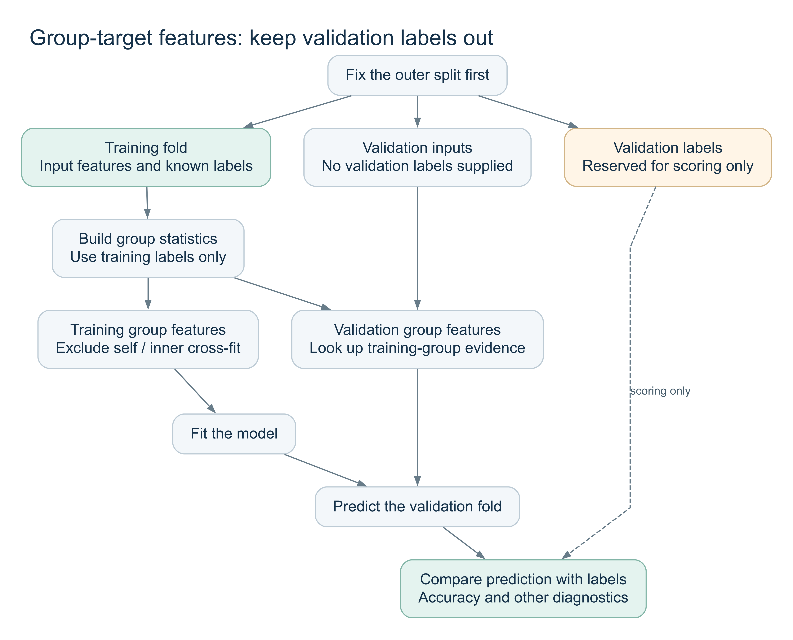
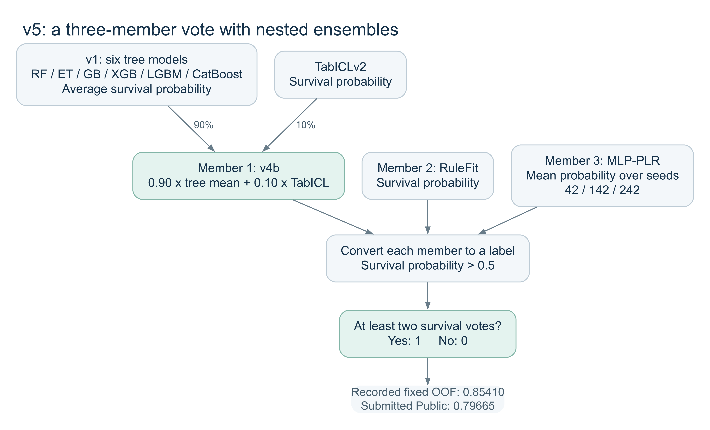
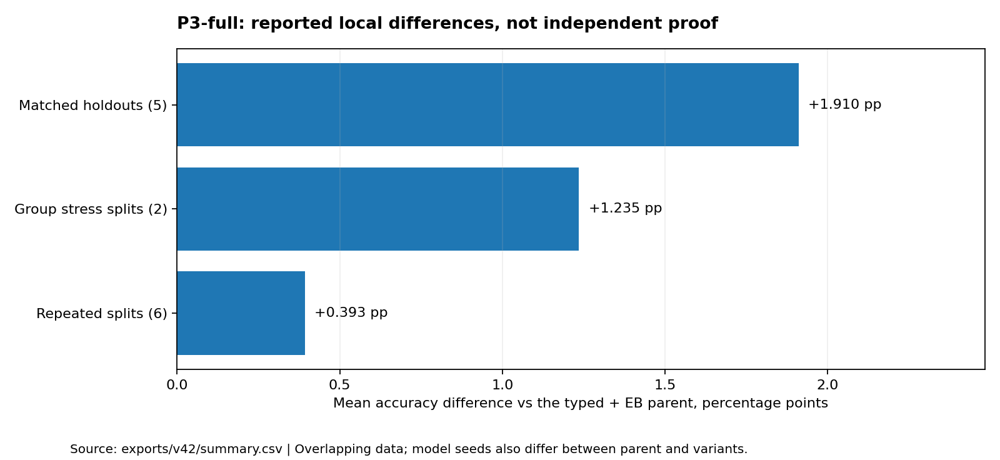
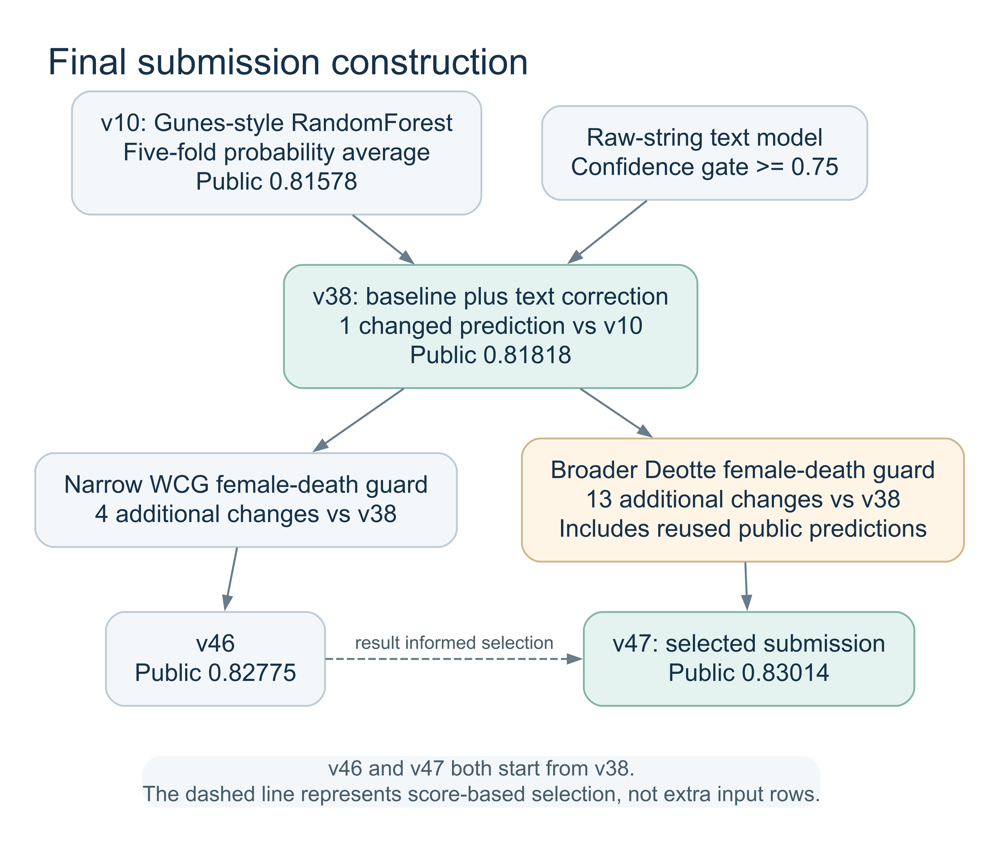

# 02. 단계별 실험 기록

[프로젝트 홈](../README.md) / [검증과 한계](03-validation-and-integrity.md)

실험을 진행한 순서에 따라 왜 변경했는지, 코드에서 무엇을 바꿨는지, 결과를 보고 어떤 결정을 내렸는지 정리했다. 점수가 오른 단계만 모으지 않았다. 성능이 떨어졌거나 제출하지 않은 방법도 다음 실험의 출발점이 되었기 때문이다.

OOF는 학습 데이터를 나누어 각 행을 검증용으로 예측한 결과이고, Public은 Kaggle에 제출한 파일의 점수다. 평가 대상과 생성 과정이 다르므로 두 값을 직접 이어 붙이지 않았다. 아래 점수는 보존된 파일의 기록이며, 이후 문서를 정리하면서 모델을 다시 학습하지 않았다.

## 1. v1: 비교할 기준선 만들기

처음에는 한 모델의 파라미터를 오래 조정하기보다 여러 트리 모델이 공통으로 활용할 수 있는 입력을 만들었다. 결측치를 채우고 문자열에서 간단한 정보를 추출한 뒤, RandomForest, ExtraTrees, GradientBoosting, XGBoost, LightGBM, CatBoost에 같은 피처를 넣었다.

### 입력을 어떻게 바꿨나

| 원본 정보 | 만든 피처 또는 처리 | 의도 |
|---|---|---|
| Name | Mr, Mrs, Miss, Master 등 Title 추출 | 성별 외에 나이대나 호칭 차이를 표현 |
| 드문 Title | Officer, Royalty, Other 등으로 통합 | 아주 적은 표본의 범주가 지나치게 세분되지 않도록 함 |
| SibSp, Parch | `FamilySize = SibSp + Parch + 1` | 함께 탄 가족의 전체 규모 표현 |
| FamilySize | `IsAlone = FamilySize == 1` | 혼자 탔는지 별도로 표시 |
| Cabin | 첫 글자를 Deck로 사용, 결측은 U | 객실 문자열을 비교적 단순한 범주로 변환 |
| Age 결측 | Title과 Pclass 조합의 중앙값으로 보완 | 모든 결측 행에 하나의 나이를 넣지 않도록 함 |
| Fare 결측 | Pclass와 Embarked 조합의 중앙값으로 보완 | 같은 등급과 출항지의 요금 수준 반영 |
| Fare | `log1p(Fare)` | 큰 요금 값의 간격을 줄임 |
| Ticket | 같은 티켓을 가진 행의 수 | 동행 규모에 관한 입력 추가 |

이 단계의 타깃과 무관한 전처리는 train과 test의 입력을 합친 뒤 계산했다. 따라서 모든 전처리를 학습 fold 안에서만 수행한 엄격한 inductive 실험은 아니다. 관계 생존률처럼 라벨을 사용하는 피처의 경계는 별도로 감사했다.

### 모델은 어떻게 합쳤나

여섯 모델의 생존 확률을 같은 비중으로 평균했다. 한 모델이 확률을 높게 주고 다른 모델이 낮게 주는 경우를 평균으로 완화하려는 구성이었다.

```text
ensemble_probability = (p_RF + p_ET + p_GB + p_XGB + p_LGBM + p_CatBoost) / 6
```

트리는 비교적 얕게 설정했다. 예를 들어 이 기준 구현의 RF와 ET는 150개 트리와 깊이 5를 사용했다. 작은 데이터에서 복잡한 구조를 먼저 만들기보다 이후 변경을 비교할 출발점을 확보하는 데 목적이 있었다.

기록된 v1의 fold-safe 감사 Accuracy는 0.84848, 최초 Public은 0.79186이었다. 두 값의 차이만으로 원인을 단정하지 않고 이후 실험의 기준으로 남겼다.

구현은 [audit_group_survival.py](../scripts/audit_group_survival.py)의 `build_base_frame`, `build_models`에서 확인할 수 있다. 평가 자료는 [wcg_audit_v1](../exports/wcg_audit_v1/)에 있다.

## 2. v2: 요금을 동행 인원과 함께 해석하기

원본 Fare를 그대로 쓰면 같은 티켓을 공유하는 여러 사람이 비슷한 요금으로 나타나는 상황을 충분히 구분하지 못할 수 있었다. 그래서 티켓 공유 인원으로 나눈 요금을 추가했다.

```text
FarePerPerson = Fare / TicketFreq
LogFarePerPerson = log1p(FarePerPerson)
```

예를 들어 Fare가 같아도 한 사람이 그 티켓을 사용하는 경우와 여러 사람이 공유하는 경우를 다르게 표현할 수 있다. 이것이 실제 개인별 지불액과 항상 일치한다고 가정한 것은 아니다. 원본 변수와 다른 관점의 입력이 도움이 되는지 확인하려는 피처였다.

가족 크기도 혼자, 2~4명, 5~6명, 더 큰 가족으로 묶었다. `IsMarriedWoman`, `Age × Pclass`, 아동 여부, 티켓의 문자 접두어도 추가했고, 모델 확률 결합 방식과 WCG 후처리도 바꿨다.

결과는 기대와 달랐다. fold-safe 감사 Accuracy는 0.84175, Public은 0.78708로 v1보다 낮았다. 여러 변경이 한 번에 들어갔으므로 특정 피처 하나가 원인이라고 분리해 말할 수는 없었다. 이 경험 이후에는 피처 묶음을 나눠 비교하고, 전체 점수뿐 아니라 바뀐 예측을 살피는 쪽으로 진행했다.

구현은 [audit_group_survival.py](../scripts/audit_group_survival.py)의 `profile="v2"` 분기, 제출 결과는 [제출 기록](evidence/kaggle-submissions.csv)에 있다.

## 3. v3: 가족 생존률을 쓰는 방법부터 다시 확인

가족이나 같은 티켓을 가진 사람이 비슷한 결과를 가질 수 있다는 가정에서 GroupSurvival을 사용했다. 문제는 이 통계를 언제, 어떤 라벨로 계산하는가였다.

전체 train의 생존 정보를 먼저 계산한 뒤 fold를 나누면 validation의 라벨이 피처 안에 들어갈 수 있다. 자기 자신만 제외하는 leave-one-out도 충분하지 않을 수 있다. 한 가족의 두 사람이 같은 validation fold에 들어갔다면, 자기 라벨은 제외해도 다른 validation 가족의 라벨을 읽을 수 있기 때문이다.

그래서 validation의 관계 피처는 그 fold의 학습 라벨만 사용하도록 비교했다. 학습 행에 피처를 붙일 때는 자기 행을 peer에서 제외했다. 의도한 경계는 다음과 같다. 실제 모든 스크립트가 전처리 전체까지 이 원칙을 지켰다는 인증 그림은 아니다.



[흐름도 소스](diagrams/validation-boundary.dot) / [확대 보기](assets/validation-boundary.svg)

기존 GroupSurvival의 의미는 유지했다. 여성 또는 아동인 reference 행에서 같은 Ticket을 먼저 찾고, FamilyGroup을 다음으로 확인했다. peer가 모두 생존이면 1, 모두 사망이면 0을 넣었다. 정보가 없거나 결과가 섞인 경우에는 현재 값을 유지하며 기본값은 0.5였다. 숫자 0.5는 확정된 생존 정답이 아니라 관계 정보가 없는 상태를 나타내는 피처였다.

이후 실험에서는 이 그룹 정보의 유무와 계산 방식을 나눠 비교했다. 목적은 좋은 점수를 버리는 것이 아니라, 모델이 일반 입력에서 배운 부분과 라벨을 미리 본 효과를 구분하는 것이었다.

구현과 당시 변형은 [audit_group_survival.py](../scripts/audit_group_survival.py)의 `add_group_survival`과 [초기 기록](../archive/session-notes/discoveries.md)에 남아 있다.

## 4. v4~v5: 모델 개수보다 오류의 차이를 이용

### v4b의 90:10 블렌딩

기존 트리 평균과 다른 방식으로 데이터를 해석하는 TabICLv2를 시험했다. TabICL 단독 제출은 0.78708이었지만 기존 트리 결과에 작은 비중으로 섞었을 때는 0.79425가 나왔다.

```text
p_v4b = 0.90 × p_tree_average + 0.10 × p_TabICLv2
```

단독 모델이 더 낮은 점수를 받았다고 해서 조합에도 도움이 없는 것은 아니었다. 기존 모델이 틀린 일부 행에서 다른 예측을 제공할 수 있기 때문이다. 다만 이 비중이 보편적으로 최적이라는 뜻은 아니며, 이 프로젝트에서 선택한 조합이다.

### v5의 세 멤버 다수결

다음에는 v4b, RuleFit, MLP-PLR을 최상위 세 멤버로 구성했다. v4b는 여러 트리와 TabICL을 이미 섞은 멤버이고, RuleFit은 규칙 기반 표현, MLP-PLR은 신경망 표현을 제공했다. 멤버별 확률을 label로 바꾼 뒤 세 멤버 중 두 멤버 이상이 생존을 예측하면 1로 결정했다.



[흐름도 소스](diagrams/v5-ensemble.dot) / [확대 보기](assets/v5-ensemble.svg)

MLP는 seed42만으로 끝내지 않았다. 단일 실행이 좋더라도 다른 초기값에서 흔들릴 수 있어 42, 142, 242의 확률을 평균했다.

```text
p_MLP = (p_seed42 + p_seed142 + p_seed242) / 3
v5 = majority(label_v4b, label_RuleFit, label_MLP)
```

seed42 MLP를 사용한 다수결 OOF는 0.85522였고, seed 평균을 사용한 robust 다수결은 0.85410이었다. 로컬 최고값을 조금 낮추더라도 특정 초기값에 덜 의존하는 구성을 기준으로 남겼다. robust 제출의 Public은 0.79665였다.

이때 후보를 Accuracy 순으로만 고르지 않았다. 기존 모델이 틀린 행을 맞힌 수인 rescue, 반대로 맞던 행을 틀리게 바꾼 수인 harm도 비교했다. 다른 예측을 많이 낸다는 사실 자체가 장점은 아니었다.

구현은 [v4 blend](../scripts/build_v4_blend_candidate.py), [MLP seed 비교](../scripts/probe_mlp_plr_seeds_v5.py), 결과는 [v5 자료](../exports/v5/)에 있다.

## 5. v6~v8, v12: 피처 추가와 스태킹이 항상 낫지는 않았다

이 구간에서는 객실 정보, 나이 구간, 결측 여부, 상호작용, 관계 기반 보간 등을 피처 묶음 단위로 추가했다. 모든 피처를 한꺼번에 넣는 대신 추가한 블록이 기존 입력에 없는 정보를 주는지 확인하려 했다.

성씨와 Fare를 함께 쓰는 FamilyFare는 단순 성씨만 사용하는 가족 키와 다른 그룹을 만들었다. 같은 성씨라도 요금이 다르면 별도 그룹이 되고, 같은 성씨와 요금을 가진 행은 동행 정보의 후보가 된다. 해당 그룹에서 생존률뿐 아니라 정보가 있는지, peer 수가 얼마나 되는지, smoothing한 평균을 함께 만들었다.

TabPFN의 여러 버전, native categorical CatBoost, 제한적인 CatBoost와 RuleFit 파라미터 조정도 시험했다. 일부 후보는 AUC나 특정 fold에서 좋아졌지만 당시 v5의 Accuracy를 안정적으로 넘지 못했다. 이미 본 fold에서 가장 좋은 작은 변형을 계속 고르는 것보다 다른 학습 방식이나 입력 표현을 찾는 데 비중을 두었다.

스태킹에서는 base model의 OOF 확률을 열로 모으고 Logistic 메타 모델을 학습했다. 단순 확률 평균과 달리 모델별 가중 조합을 학습할 수 있지만, 메타 모델도 작은 표본에서 선택된다. 기록된 비교에서는 AUC가 올라가고 Accuracy는 내려가는 경우가 있었다.

예측 확률이 0.60에서 0.70으로 바뀌어도 0.5 기준 label은 같다. 반면 0.51이 0.49로 바뀌면 label 하나가 달라진다. 따라서 확률 순위가 나아졌다는 AUC 결과와 최종 이진 정답 수가 늘었다는 결과를 구분했다. 스태킹 전체가 나쁜 방법이라고 결론내리지 않고, 시험한 조합에서 추가 이득이 충분하지 않았다고 기록했다.

당시 피처와 모델 비교 자료는 [v6](../exports/v6/), [v7](../exports/v7/), [v12](../exports/v12/)에 있다. 메타 모델의 평가 경계에 남는 한계는 [검증 문서](03-validation-and-integrity.md)에 정리했다.

## 6. v9~v13: Gunes 방식에서 무엇이 달랐나

새 모델을 추가하는 대신 공개 Titanic 방법의 전처리와 관계 통계를 재현했다. v9는 피처를 기존 검증 흐름에 옮기는 방향이었고, v10은 공개 노트북의 역사적 동작을 가능한 한 유지하는 방향이었다. 둘은 같은 모델에 피처 하나만 바꾼 비교가 아니다.

### 구간화와 범주 통합

v10은 Age를 10개, Fare를 13개 분위수 구간으로 나눴다. 분위수 구간은 값의 간격보다 구간 안의 표본 수를 비슷하게 맞춘다. 극단적으로 큰 요금 한두 개와 작은 연속값 차이에 지나치게 반응하지 않도록 표현을 단순하게 만드는 가설이었다. 경계는 train과 test의 입력을 합쳐 계산했다.

Deck는 A/B/C를 ABC, D/E를 DE, F/G를 FG로 묶고 결측을 M으로 두었다. 작은 범주를 합쳐 더 많은 관측을 공유하도록 한 것이다. Title도 여러 여성 호칭과 드문 전문직 호칭을 각각 더 큰 범주로 묶었다. 세부 정보를 줄이는 대신 범주별 표본 수를 확보하려는 선택이었다.

### 두 개의 관계 통계와 정보 존재 여부

Family와 Ticket별 생존 중앙값을 만들었다. 가족 크기 조건을 만족하고 test에도 나타나는 그룹에 대해 관계 값을 사용했으며, 해당 정보가 없는 경우 전체 train 생존률로 채웠다. 가족과 티켓의 값을 평균한 `Survival_Rate`, 두 경로의 정보가 있는지를 평균한 `Survival_Rate_NA`를 모델에 넣었다.

```text
Survival_Rate = (Family_Survival_Rate + Ticket_Survival_Rate) / 2
Survival_Rate_NA = (Family_available + Ticket_available) / 2
```

이렇게 하면 같은 0.5 부근의 값이라도 실제 가족 정보를 평균한 것인지 기본값을 채운 것인지 구분할 수 있다. 최종 입력은 26개 피처였고, RF는 1,750개 트리, 깊이 7, `min_samples_split=6`, `min_samples_leaf=6`을 사용했다. 5개 fold 모델의 test 확률을 평균했다.

### 결과와 남은 문제

v9의 Public은 0.78229였지만 v10은 0.81578이었다. 이 차이를 분위수 구간화 하나나 특정 모델 설정 하나의 효과로 설명할 수는 없다. 전처리, 통계 생성, 모델과 평가 조건이 함께 달라졌다.

특히 v10은 전체 train 라벨로 관계 통계를 만든 뒤 CV를 수행했다. train과 test의 인코더와 scaler를 따로 fit하는 동작도 있다. 원본 방식의 OOF 0.83614를 무누출 성능으로 사용할 수 없는 이유다. 이후 v11과 v13은 같은 메커니즘을 fold별로 재작성해 비교했지만, Public에서의 순서를 완전히 설명하지는 못했다.

구현은 [reproduce_gunes_original_v10.py](../scripts/reproduce_gunes_original_v10.py), 검증 재작성은 [gunes_exact_foldsafe_v11.py](../scripts/gunes_exact_foldsafe_v11.py), 당시 결과는 [v10](../exports/v10/)과 [v13](../exports/v13/)에서 확인할 수 있다.

## 7. v14~v20: 관계 통계를 역할별로 나누고 검증 조건 변경

### typed22를 만든 이유

가족 전체의 생존률 한 개에는 성인 남성과 여성 또는 아이의 다른 패턴이 섞일 수 있었다. 그래서 Family와 Ticket 관계 안에서 전체 peer, 여성과 아이, 성인 남성을 나눈 통계를 만들었다. 이 분기의 WomanChild는 여성, 관측 나이 16세 미만 또는 Master 호칭에 해당하는 행이다. 초기 WCG의 아동 기준과 완전히 같은 정의는 아니므로 구분했다.

단순 평균만 주지 않고 count와 smoothing한 값도 함께 넣었다. peer 한 명이 생존한 경우와 여러 명이 모두 생존한 경우를 모델이 구별하도록 한 것이다. 기본 smoothing은 생존 합에 prior를 일정 비중으로 더하는 형태다.

```text
smoothed_rate = (peer_survival_sum + alpha × prior) / (peer_count + alpha)
```

### 실제 test와 비슷한 holdout 만들기

실제 test 행 중 train에 가족이 연결된 비율, 티켓이 연결된 비율, 두 경로가 모두 연결된 비율을 먼저 계산했다. 성별, 등급, 아동 비율, 결측 비율과 peer 수도 함께 봤다. train에서 178행을 뽑은 후보들을 만들고 이 입력 통계가 test와 가까운 holdout 다섯 개를 골랐다. split 선택에 Survived를 넣지 않는 것이 원칙이었다.

처음 결과에서 가족 eligibility 정의가 달랐던 부분을 수정한 뒤, corrected pseudo-test에서 `legacy2`의 평균 Accuracy는 0.84270, `typed22`는 0.85618이었다. 차이는 0.01348이었다. 관계 정보를 역할과 근거 수로 나누는 가설을 더 살펴볼 이유는 있었지만, 이미 일부 모델 선택에 사용한 holdout이므로 독립적인 최종 시험은 아니었다.

### 앙상블에 넣었을 때는 어땠나

typed 피처를 CatBoost와 TabPFN 등에 옮긴 다음, 여러 모델이 일치할 때만 v5 예측을 바꾸는 보수적 규칙을 시험했다. v19 검증을 거친 strict consensus의 Public은 0.79425였다. v10을 기준으로 관계 근거가 약한 행만 바꾸는 guard도 시험했지만 Public 0.81100으로 기존 v10보다 낮았다.

피처 블록의 로컬 개선과 그것을 사용한 최종 제출 파일의 개선은 같지 않았다. 이 결과 때문에 관계 그룹을 아예 분리하는 검증과 다른 split seed 비교를 추가했다.

구현은 [pseudo_test_relational_v14.py](../scripts/pseudo_test_relational_v14.py), [v19 전체 재학습 비교](../scripts/pseudotest_consensus_v19.py), [v20 guard 비교](../scripts/pseudotest_v10_guard_v20.py)에 있다.

## 8. v21~v25: Deotte 규칙, 그룹 검증, 제한 HPO

### 더 정밀한 그룹 정의

Deotte 방식은 성씨만 같은 사람을 모두 같은 가족으로 취급하지 않았다. 성씨, Pclass, 마지막 글자를 가린 Ticket, Fare, Embarked를 묶어 그룹을 만들고 성인 남성을 여성과 아이의 그룹과 분리했다. 혼자 남은 그룹을 처리한 뒤 같은 티켓 구조의 동행 관계를 연결하는 규칙도 있었다.

WCG 규칙을 바탕으로 예측을 만들고 성인 남성과 혼자 탄 여성에 대해 별도 XGBoost 보정을 적용했다. Python 포트는 원본의 R imputation을 근사했다. 다른 한편 `exact_public` 파일에는 공개 노트북 실행 출력에서 복구한 개별 예측 목록을 사용했다. 포트의 검증 점수와 외부 예측을 넣은 test 파일의 출처는 서로 다르다.

### 관계 그룹 전체를 나눠보기

Ticket이나 Family로 연결되는 행을 하나의 연결요소로 묶고, 같은 연결요소가 train과 validation에 나뉘지 않도록 했다. 이 조건에서는 새로운 가족이나 여행 집단을 예측하는 능력을 더 직접적으로 시험한다.

기록된 group-aware 평균은 Deotte 0.82604, v5 0.81033이었다. 반대로 일반 repeated 검증에서 Deotte의 평균은 0.84623으로, fixed 한 번의 0.85410보다 낮았다. 하나의 split이나 검증 유형만 보고 승자를 정하기 어려웠다. 실제 test에는 train과 연결되는 집단도 있으므로 group split이 그 환경 전체를 그대로 재현하는 것도 아니다.

### 38개 설정의 제한 탐색

typed 피처 위에서 XGBoost 12개, LightGBM 10개, RF 8개, ExtraTrees 8개 설정을 시험했다. 고정 fold의 상위 후보만 다른 split에서 다시 비교했다. RF 설정 하나는 fixed에서 0.85522였지만 alternate split에서는 0.84400과 0.84287로 낮아졌다. 설정 선택까지 포함하면 고정 fold의 최고값이 낙관적일 수 있었다.

### 마지막 다수결의 실패

v25는 v5 robust, Deotte, typed RF6의 세 예측을 다수결로 합쳤다. 당시 기록은 fixed OOF 0.85746, pseudo 평균 0.86067이었지만 Public은 0.79186이었다. 서로 다른 모델 이름을 섞었다는 사실만으로 오류가 독립적인 것은 아니었다. 실제로 표를 뒤집는 행은 소수였고, 그 행에서 두 모델이 같은 방향으로 틀리면 다수결도 실패한다.

구현은 [Deotte 포트](../scripts/deotte_wcg_xgb_v21.py), [제한 HPO](../scripts/limited_hpo_v22.py), [group-aware 검증](../scripts/groupaware_validation_v23.py), [v25 조합](../scripts/finalist_majority_v25.py)에 있다.

## 9. v26: train과 test가 쉽게 구분되는지 확인

CV와 Public이 계속 어긋나자 입력 분포 차이를 확인했다. train 행에는 domain label 0, test 행에는 1을 붙이고 생존 여부 대신 파일 출처를 맞히는 분류기를 학습했다. PassengerId는 데이터 분할 자체를 거의 직접 알려주므로 입력에서 제외했다. Survived도 사용하지 않았다.

기본 속성, 결측 여부, Title과 Deck, 가족 크기, 티켓 빈도와 요금 변형을 넣고 Logistic, ExtraTrees, LightGBM을 비교했다. 보고된 최고 AUC는 약 0.555였다. 시험한 모델에서는 두 파일을 강하게 구분하지 못했다.

추정한 test-likeness를 가중치로 바꿔 기존 OOF를 다시 계산하는 진단도 했다. 다만 domain classifier에 balanced class weight를 사용했기 때문에 raw 확률을 실제 domain 비율의 확률처럼 해석하려면 보정이 필요하다. 이 실험으로 분포 차이가 없거나 CV와 Public 차이의 원인이 완전히 배제됐다고 말하지 않는다. 이 정도 근거로 대규모 domain adaptation을 시작하지 않았다는 운영 판단만 남겼다.

구현은 [adversarial_validation_v26.py](../scripts/adversarial_validation_v26.py), 결과는 [v26](../exports/v26/)에 있다.

## 10. v27~v34: 작은 그룹을 과신하지 않도록 보정

### Empirical-Bayes partial pooling

그룹 안에 라벨이 있는 사람이 한 명뿐인데 그 사람이 생존했다면 단순 평균은 1.0이다. 이 값을 많은 사람이 모두 생존한 그룹과 같은 확신으로 사용할 수는 없다. 그래서 그룹 관측과 역할별 기준 확률을 함께 사용했다.

```text
posterior = (survival_sum + alpha × role_class_prior) / (peer_count + alpha)
```

계산 예로 prior가 0.6, alpha가 4이고 peer 한 명이 생존했다면 결과는 `(1 + 4 × 0.6) / 5 = 0.68`이다. 이 숫자는 설명용 예시다. 실제 코드는 fold-train에서 역할과 등급 prior를 계산하고, 그룹 통계의 분산으로 alpha를 추정해 범위를 제한했다.

Family, Ticket, FamilyFare 각각에 전체 peer와 같은 역할 peer의 posterior를 만들었다. count, prior와의 차이, 여러 그룹의 결합값도 추가했다. 정보가 적을수록 prior 쪽으로 당기고, 정보가 많을수록 그룹의 관측이 더 반영되는 구조다.

| v27 표현 | 4-seed 평균 Accuracy |
|---|---:|
| typed22 | 0.84035 |
| EB25 | 0.84708 |
| typed22 + EB25 | 0.84820 |

이 비교에서는 개선이 관찰됐다. 그러나 FamilyFare와 강한 CatBoost에 이식한 v28에서는 기존 typed22 CatBoost를 안정적으로 넘지 못했다. 약한 비교 모델에서 도움이 된 피처가 더 강한 모델에서도 같은 추가 이득을 주지는 않았다.

### 모델을 고르는 절차까지 평가

v29는 outer-train 내부의 inner CV에서 후보를 선택하고, 선택한 모델을 outer-validation에서 평가했다. 후보군은 Deotte, typed CatBoost, typed RF6, EB CatBoost, typed+EB CatBoost였다. 선택 결과가 fold마다 달랐고 outer seed에 따라 v5 대비 차이의 방향도 바뀌었다.

그래서 v30은 inner 선택 없이 후보를 고정해 비교했고, v31에서는 typed+EB CatBoost와 v5 구조를 같은 split에서 여섯 seed로 비교했다.

| Split seed | v5 | typed+EB CatBoost | 차이 |
|---:|---:|---:|---:|
| 42 | 0.85410 | 0.85073 | -0.00337 |
| 123 | 0.84287 | 0.84400 | +0.00112 |
| 777 | 0.83726 | 0.84512 | +0.00786 |
| 2026 | 0.83614 | 0.84287 | +0.00673 |
| 31415 | 0.83951 | 0.85971 | +0.02020 |
| 27182 | 0.84736 | 0.85410 | +0.00673 |

하지만 v32 group-aware 결과는 0.79574와 0.79237이었고, pseudo-test 다섯 개에서는 개선 하나, 동률 하나, 악화 셋이었다. 일반 repeated CV만 보면 유망했지만 다른 조건에서의 근거는 약했다.

v33과 v34에서는 EB를 Deotte와 v5 다수결에 넣는 후보도 살폈다. 로컬 이득이 있더라도 실제 test에서는 기존 v5와 거의 같은 예측을 내는 문제가 있었다. 새로운 피처가 있다는 것과 현재 Public 기준을 넘길 만큼 다른 예측을 한다는 것을 구분할 필요가 있었다.

이 과정은 이전의 탐색 편향을 없앤 독립 실험은 아니다. 후보군과 피처가 이미 같은 데이터에서 발전했기 때문이다. prior와 alpha의 self-influence, 비교별 모델 seed 차이도 [검증 문서](03-validation-and-integrity.md)에 남겼다.

구현은 [EB 피처](../scripts/partial_pooling_v27.py), [강한 모델 이식](../scripts/partial_pooling_transfer_v28.py), [nested 선택](../scripts/nested_selection_audit_v29.py)에 있고, 위 표의 원본은 [paired_seed_comparison.csv](../exports/v31/paired_seed_comparison.csv)다.

## 11. v35~v39: 계속 틀리는 행에서 문자열 정보 찾기

### 승객 단위로 오답 묶기

기존 예측을 PassengerId로 맞춰 여러 seed와 모델에서 계속 틀리는 승객을 찾았다. v35 기준 stable-hard는 121/891명이었다. 1등석 남성, 3등석 여성과 일부 티켓 접두어 구간 등에서 오답이 상대적으로 많았다.

여기서 특정 승객의 정답을 외워 규칙을 만들기보다, 기존의 요약 피처가 버린 입력 표현을 추가로 시험했다. 다만 오답을 본 뒤 가설을 만들었으므로 이 분석 자체는 발견 단계이며 독립 검증이 아니다.

### 문자 n-gram 모델

Name, Ticket, Cabin을 문자열로 합치고 2~5글자 character n-gram TF-IDF를 만들었다. 최소 두 번 나타나는 조각을 사용하고 최대 12,000개 피처로 제한했다. vectorizer는 각 학습 fold 안에서 fit했으며 LogisticRegression은 `C=1.5`를 사용했다.

이 방법은 Title이나 Deck 같은 정해진 요약만 주는 대신 이름과 티켓의 짧은 문자열 패턴을 학습하게 한다. 단독 repeated Accuracy는 약 0.813~0.822로 v5보다 낮았다. 하지만 기존 모델과 다른 예측을 하는 일부 행에서는 보완 가능성이 보였다.

### 확신이 높은 불일치만 사용

전체 예측을 교체하지 않고 기존 모델과 반대이면서 `max(p, 1-p) >= 0.75`인 경우에만 text 예측을 사용했다. v37은 v5를 기준으로, v38은 v10의 재작성 analogue를 기준으로 비교했다.

실제 v38 파일은 v10과 한 행만 달랐고, 나중에 제출했을 때 Public 0.81818을 기록했다. 다만 이 gate의 로컬 성공 사례에는 같은 승객이 여러 split에서 반복된 경우가 많았다. 여러 번 성공했다는 수치를 여러 독립 표본에서 성공한 것으로 해석하지 않았다.

v39에서는 Name, Ticket, Cabin을 따로 사용해 어떤 입력이 그 차이를 만드는지 봤다. 유망한 보정 중 하나에서 이름보다 티켓의 숫자 패턴이 관련되어 있었고, 다음 실험에서는 이를 전체 승객에게 같은 방식으로 적용되는 숫자 prefix 피처로 옮겼다.

구현은 [오답 분석](../scripts/residual_forensics_v35.py), [raw-string 모델](../scripts/raw_string_text_v36.py), [text gate](../scripts/text_rescue_gate_v37.py), [v10 보정](../scripts/v10_text_rescue_v38.py), [문자열 ablation](../scripts/raw_string_field_ablation_v39.py)에 있다.

## 12. v40: 그래프의 구조만으로 추가 정보를 얻을 수 있나

같은 Ticket, 가족 키, Cabin 토큰을 공유하면 승객을 연결한 그래프를 만들었다. 기존의 그룹 크기 외에 연결 수, 가중 연결 수, PageRank, k-core, articulation point, betweenness, 삼각형 수와 연결요소 밀도를 계산했다. 그래프를 구성하는 데 생존 라벨은 사용하지 않았다.

이 가설은 같은 그룹에 속했다는 정보 외에도 그룹 안에서 여러 관계를 연결하는 위치가 도움이 될 수 있다는 것이었다. 예를 들어 티켓과 가족 관계를 동시에 이어주는 행과 하나의 관계만 가진 행을 구별할 수 있다. 그런 구조가 실제 생존의 원인이라는 가정까지 입증한 것은 아니다.

FamilyFare+typed22+EB CatBoost에 그래프 블록을 더한 기록에서 평균 Accuracy 차이는 fixed -0.00336, pseudo -0.00562, group -0.00337이었다. 당시 비교에서는 추가하지 않는 쪽을 선택했다. parent와 변형에 서로 다른 모델 seed를 사용한 부분이 있어 차이 전체를 그래프 피처 하나의 효과로 단정하지 않는다.

구현은 [graph_centrality_v40.py](../scripts/graph_centrality_v40.py), 결과는 [v40](../exports/v40/)에 있다.

## 13. v41~v44: 숫자 티켓의 앞 세 자리를 피처로 사용

### 정확히 같은 티켓만 보던 범위를 넓힘

기존 TicketFreq와 Ticket survival은 정확히 같은 티켓끼리 묶었다. 숫자 prefix는 번호가 완전히 같지 않아도 앞부분을 공유하는 행을 묶는다. 예를 들어 `364856`의 P2는 `36`, P3는 `364`다. 이런 숫자 구간이 기존 성별과 등급, 가족 관계 외에 도움이 되는 통계를 제공하는지 시험했다.

prefix 자체를 승객별 정답 규칙으로 쓰지 않았다. 모든 행에서 같은 방식으로 prefix를 추출하고, fold-train 라벨로 EB posterior를 계산했다. P3-full은 전체 peer의 posterior, count와 prior 차이, 같은 역할 peer의 세 통계, 티켓 숫자 길이를 추가한 블록이다.

### P2와 P3를 나눠 비교

v41은 P2와 P3를 함께 넣었다. 평균 개선이 있어도 한 seed에서 크게 나빠져 v42에서는 P2 전체, P3 단순, P3 전체, P2+P3 전체를 분리했다. 기록상 P3-full이 parent 대비 가장 일관된 결과를 보였다.

| 검증 | P3-full 평균 Accuracy | parent 대비 차이 | 개선한 split 수 |
|---|---:|---:|---:|
| Repeated | 0.85279 | +0.00393 | 5/6 |
| Group-aware | 0.80752 | +0.01235 | 2/2 |
| Pseudo-test | 0.86067 | +0.01910 | 5/5 |



이 표의 parent는 typed+EB CatBoost다. 모든 차이가 v5 대비라는 뜻은 아니다. 또한 모델 seed까지 완전히 고정한 ablation은 아니므로 P3의 순수 효과가 정확히 이 크기라고 해석하지 않는다.

### 안정성과 변경 정확도를 따로 확인

v43에서는 여섯 split seed마다 다섯 fold 모델을 만들고 test 확률을 평균했다. 418행 중 403행은 seed별 label이 같았다. v44의 여섯 seed bagged OOF Accuracy는 0.85971이었다.

하지만 기존 v5 OOF와 다른 49행 중 27행은 고쳤고 22행은 오히려 틀리게 바꿨다. 변경한 행에서 후보가 맞힌 비율은 55.10%였다. 전체 Accuracy의 작은 상승만 보고 바뀐 예측이 매우 정확하다고 가정할 수 없었다.

당시 test 후보는 v5와 24행 달랐다. 같은 평가 행에서의 이진 Accuracy라는 가정 아래, v10과 v5 사이의 정답 수 차이 8개를 엄격히 넘으려면 24개 변경 중 최소 17개를 맞혀야 했다. 이 계산은 필요한 조건이지 성공 확률의 추정이 아니다. 로컬의 55.10%를 다른 test 불일치 집합에 그대로 적용할 수도 없다.

이 후보는 처음에는 보류했다가 마지막 승인 제출에서 실제로 시험했고 Public 0.79665를 기록했다. 이번 사례에서는 로컬 이득이 제출 이득으로 이어지지 않았다.

구현은 [prefix 피처](../scripts/ticket_numeric_prefix_v41.py), [P2/P3 ablation](../scripts/ticket_prefix_ablation_v42.py), [test bagging](../scripts/ticket_prefix_finalist_v43.py), [변경 정확도 비교](../scripts/ticket_prefix_switch_precision_v44.py)에 있다. 위 수치는 [v42](../exports/v42/summary.csv)와 [v44](../exports/v44/summary.csv)에서 확인할 수 있다.

## 14. 마지막 제출: v10을 남기고 일부 예측만 바꾸기

후반 로컬 실험만으로는 기존 Public 기준을 안정적으로 넘는 파일을 고르기 어려웠다. 가능성 있는 후보를 실제로 제출하기로 한 뒤, 전체 모델 교체와 일부 규칙 보정을 함께 시험했다.

### v38: 높은 확신의 텍스트 보정

v10의 예측을 기본으로 두고 텍스트 모델이 높은 확신으로 반대하는 경우만 바꿨다. 실제 파일은 v10과 한 행 달랐고 Public은 0.81578에서 0.81818로 올라갔다. 기존 예측의 대부분을 유지하면서 다른 입력 표현을 제한적으로 사용한 경우였다.

### v45: 높은 모델 확률도 틀릴 수 있었다

v38에 P3 확신도 0.90 이상의 추가 보정을 적용했다. 이 규칙은 실제 파일에서 한 행을 더 바꿨지만 Public은 0.81578로 내려갔다. 모델 확률 0.9 이상이나 여러 seed의 합의만으로 새로운 행의 정답을 보장할 수 없었다. 이 후보는 최종 선택에서 제외했다.

### v46과 v47: 두 범위의 여성 사망 guard

v46은 v38에 좁은 WCG 여성 사망 규칙을 적용했다. 네 행이 추가로 바뀌었고 Public은 0.82775였다. v47은 v38에 더 넓은 Deotte 여성 사망 예측을 적용했다. v38과 13행이 달랐으며 Public 0.83014를 기록했다.

넓은 규칙의 13행 안에는 좁은 규칙의 네 행이 포함된다. 코드도 v46에 13행을 새로 더하는 형태가 아니라, v38에서 출발해 broad guard와 v10이 다른 위치만 교체하는 형태다.

```text
candidate = v38.copy()
replace_rows = broad_guard != v10
candidate[replace_rows] = broad_guard[replace_rows]
```



[흐름도 소스](diagrams/final-lineage.dot) / [확대 보기](assets/final-lineage.svg)

### 실제 제출 결과

| 후보 | Public | 이후 결정 |
|---|---:|---|
| v38, 텍스트 보정 | 0.81818 | 후속 guard의 시작점으로 사용 |
| v43, P3 전체 bagging | 0.79665 | 전체 모델 교체 후보 제외 |
| v45, P3 고확신 추가 보정 | 0.81578 | 추가 보정 제외 |
| v21, 공개 출력 재구성 | 0.81339 | 단독 제출 후보 제외 |
| v46, 좁은 WCG guard | 0.82775 | 더 넓은 guard와 비교 |
| v47, 넓은 여성 사망 guard | 0.83014 | 최종 Public 파일로 보존 |
| v21, Python WCG-both 포트 | 0.80382 | 단독 제출 후보 제외 |

v46의 점수를 본 뒤 v47을 비교하는 등 Public 결과가 이후 선택에 사용됐다. 넓은 guard에는 공개 노트북에서 가져온 개별 예측도 포함된다. 따라서 마지막 점수를 사전에 봉인한 독립 평가나 공식 train만으로 학습한 하나의 새 모델 성능으로 설명하지 않는다.

구현은 [v46](../scripts/v46_v38_plus_wcg_female_guard.py), [v47](../scripts/v47_v38_plus_all_deotte_female_guard.py), 실제 제출 시각과 ID는 [제출 기록](evidence/kaggle-submissions.csv)에 있다.

## 정리

점수는 최초 0.79186에서 0.83014까지 올랐다. 과정은 새로운 모델이 이전 모델을 계속 대체하는 직선적인 흐름이 아니었다. 단순 피처 추가는 실패했고, 일부 새로운 표현은 로컬에서만 좋아졌다. 마지막 Public 점수는 기존 v10을 유지하면서 텍스트와 Deotte 계열 예측을 일부 결합한 파일에서 나왔다.

이 기록에서 확인할 수 있는 것은 각 코드와 제출이 낸 결과다. 스킬만의 기여량, 각 피처의 인과적 효과, 새로운 데이터에서의 같은 성능까지 측정한 것은 아니다. 평가 경계와 재사용한 자료에 관한 설명은 [검증과 한계](03-validation-and-integrity.md), 파일을 직접 확인하는 방법은 [재현 문서](05-reproduction.md)에 이어 정리했다.
