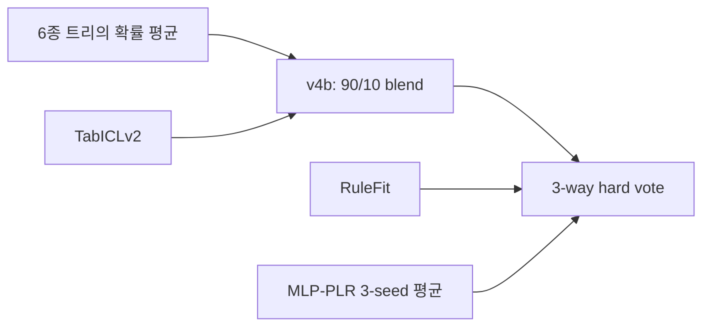

# 02. 실험 여정: 무엇을 바꾸고 무엇을 배웠나

[프로젝트 홈](../README.md) · [검증과 한계](03-validation-and-integrity.md)

이 문서는 당시 기록된 결과를 정리한 회고입니다. 여기서 “개선”은 명시된 비교 프로토콜에서의 수치 변화이며, 모든 경우에 독립적인 일반화 이득을 입증했다는 뜻은 아닙니다. 출처 파일은 해당 단락 끝에 연결했습니다.

## 1. v1~v3: 강한 기준선보다 먼저 평가 경계 정리

출발점은 RandomForest, ExtraTrees, GradientBoosting, XGBoost, LightGBM, CatBoost를 포함한 트리 계열 앙상블이었습니다. 최초 제출은 **0.79186**이었습니다. 성별·등급·나이·요금 외에 호칭, 가족 크기, 혼자 탑승했는지, 티켓 공유 등의 파생 변수를 다뤘습니다.

특히 WCG(Woman-Child Group)는 함께 여행한 여성·아이 사이에 공유될 수 있는 생존 패턴을 활용하는 아이디어입니다. 문제는 그룹의 생존률을 전체 학습 데이터에서 먼저 계산하고 CV를 나누면, 검증 행의 타깃이 그룹 통계에 들어갈 수 있다는 점입니다. 자기 자신 한 명을 제외하는 LOO만으로 검증 fold 전체를 제외한 것이 되지는 않습니다.

이후 감사에서는 validation 행의 관계 피처를 해당 fold의 학습 라벨로만 계산하는 흐름을 도입했습니다. 확률 0.5를 정수로 캐스팅하는 오류, 타깃 결측치를 가진 test 행의 학습 혼입 위험도 점검했습니다. 이것은 “고급 피처를 더 넣기”보다 **기준 점수를 믿을 수 있게 만들기**에 가까운 작업이었습니다.

근거: [audit_group_survival.py](../scripts/audit_group_survival.py), [초기 작업 기록](../archive/session-notes/discoveries.md), [fold 산출물](../exports/wcg_audit_v1/).

## 2. v4~v8: 모델 종류, 오류 다양성, seed 안정성

여러 모델을 시험하되 상위 Accuracy 순으로 모두 섞는 대신, 기존 모델이 틀린 행을 다른 모델이 맞히는지 살폈습니다. 이때 중요한 구분은 **다르게 맞히는 모델**과 **다르게 틀리는 모델**입니다. 상관이 낮다는 이유만으로 멤버를 추가하면 전체 성능이 나빠질 수 있습니다.

v4b는 기존 트리 앙상블 확률 90%와 TabICLv2 확률 10%를 섞은 보수적 blend였습니다. Public은 **0.79425**였습니다. v5는 v4b, RuleFit, MLP-PLR의 세 멤버가 다수결을 하는 구조였고, MLP는 seed 42·142·242의 확률 평균을 사용했습니다.

당시 v5 robust의 기록은 OOF **0.85410**, Public **0.79665**입니다. MLP seed42 단독이 높더라도 다른 seed에서 흔들리는 현상이 있어 단일 최고점을 그대로 채택하지 않았습니다. 여기서 “3개 멤버”는 최상위 투표 수입니다. 내부 모델·seed·fold fit을 모두 세면 훨씬 많아지므로 이를 혼동하면 안 됩니다.

블렌딩과 스태킹도 수행했습니다. Logistic 메타 모델에 base OOF 확률을 넣는 방식이 일부 AUC를 높였지만 당시 평가에서 Accuracy의 일관된 추가 이득은 없었습니다. 이 결과는 스태킹이 원래 나쁘다는 증명이 아니라, **시험한 입력과 메타 모델·평가 절차에서는 승격 근거가 약했다**는 뜻입니다. 사전 계산한 OOF에 메타 CV만 추가하면 완전한 중첩 평가가 되는지도 별도로 감사해야 합니다.

근거: [v4 blend 구성](../scripts/build_v4_blend_candidate.py), [MLP seed 실험](../scripts/probe_mlp_plr_seeds_v5.py), [v5 산출물](../exports/v5/).

## 3. v9~v13, v21: 공개 고득점 방법에서 아이디어와 평가를 분리

### Gunes 계열

나이·요금 분위수 구간화는 연속값을 순서 있는 구간으로 바꾸어 비선형 경계를 더 단순하게 표현하려는 방법입니다. Deck를 ABC/DE/FG/M으로 묶는 것은 희소한 범주를 줄이는 선택입니다. 가족·티켓 생존 통계는 관계 기반 정보를 추가합니다. 이들은 모두 자동으로 도움이 되는 공식이 아니라 모델·표본·검증에 따라 평가할 대상입니다.

v10은 공개 Gunes 흐름을 역사적으로 재현했습니다. Public **0.81578**로 기존 제출보다 높았습니다. 그러나 코드가 모든 학습 라벨로 관계 통계를 먼저 계산한 뒤 CV를 수행하므로 원본 방식의 OOF **0.83614**는 누출 없는 비교 점수로 사용할 수 없습니다. train/test 인코더와 scaler를 따로 fit하는 동작도 보존되어 있습니다. 이후 v11 등의 fold-aware 재작성은 같은 아이디어를 평가 경계에 맞춰 다시 확인하는 작업이었습니다.

### Deotte 계열

Deotte 방식은 단순 성씨 평균을 넘어서 성씨·등급·마지막 문자를 가린 티켓·요금·출항지를 결합한 그룹을 만들고, 여성·아이와 성인 남성을 달리 취급했습니다. 원본 R 환경을 동일하게 재실행하지 못한 부분은 Python 근사로 구현했습니다. 동시에 일부 최종 test 예측은 공개 노트북 실행 출력에 있는 PassengerId 목록을 그대로 재사용했습니다.

따라서 `exact_public`이라는 파일명은 **완전히 동일한 모델을 재학습했다는 보장**이 아닙니다. 코드 포트의 OOF 점수와 외부 예측 목록으로 구성한 test 파일은 다른 출처를 가집니다. 실제 제출에서 공개 출력 재구성은 **0.81339**, Python WCG-both 파일은 **0.80382**였습니다.

근거: [v10 코드](../scripts/reproduce_gunes_original_v10.py), [v21 코드와 상수 목록](../scripts/deotte_wcg_xgb_v21.py), [제출 영수증](evidence/kaggle-submissions.csv). 원저자 링크는 [참고 자료](07-references.md)에 있습니다.

## 4. v14~v25: 관계 구조를 닮은 검증도 만능은 아니었다

`typed22`는 Family/Ticket 생존률을 한 종류로만 계산하지 않고 WomanChild·AdultMale 같은 역할에 따라 나눈 통계 블록입니다. 관측 수와 smoothing도 함께 제공합니다. 같은 평균 1.0이라도 peer 1명과 peer 5명은 근거의 양이 다르므로 count를 포함하는 것이 합리적입니다.

Pseudo-test는 학습 데이터 일부를 별도 검증으로 두되, 실제 test와의 Family/Ticket 연결률이나 성별·등급·아동 비율 등을 닮게 선택한 holdout입니다. 타깃으로 split을 고르지 않도록 의도했습니다. 다만 동일한 891명의 다른 부분집합이므로 반복 split의 결과를 독립 표본처럼 합칠 수는 없습니다.

Group-aware 검증은 Family/Ticket 연결요소를 같은 fold에 묶어 관계 그룹 전체가 새로 등장하는 조건을 시험합니다. 실제 test에 학습 데이터와 연결된 그룹이 존재한다면, 이 검증은 실제 평가의 완전한 복제가 아니라 **새 그룹 일반화에 대한 스트레스 테스트**입니다.

v19 strict consensus는 로컬 개선을 보였지만 Public **0.79425**, v20 보수적 guard는 **0.81100**이었습니다. v25의 v5+Deotte+RF6 다수결은 보고된 fixed OOF **0.85746**, pseudo 평균 **0.86067**이었지만 Public **0.79186**이었습니다. 이 사례는 여러 검증 지표를 충족했다는 이유만으로 실제 제출 개선을 확신할 수 없음을 보여줍니다.

근거: [pseudo-test 구현](../scripts/pseudo_test_relational_v14.py), [group-aware 구현](../scripts/groupaware_validation_v23.py), [최종 majority 구현](../scripts/finalist_majority_v25.py), [제출 기록](evidence/kaggle-submissions.csv).

## 5. v22, v26~v34: HPO보다 분포·선택 과정·작은 그룹을 점검

제한 HPO는 XGBoost 12개, LightGBM 10개, RF·ET 각 8개 설정을 시험한 기록입니다. 고정 fold에서 높은 설정이 다른 split에서 떨어졌습니다. 이것은 그 후보의 안정성 경고이지 “이 데이터에서는 HPO가 절대로 쓸모없다”는 결론은 아닙니다.

Adversarial validation은 train 행과 test 행을 구별하는 X-only 분류기입니다. PassengerId는 두 파일을 구조적으로 구분하므로 제외했습니다. 보고된 최고 AUC 약 **0.555**는 시험한 표현·모델에서 강한 구분 신호가 나오지 않았다는 의미입니다. **분포 변화가 없다는 증명은 아닙니다.** 분류기 확률을 density-ratio weight로 바꾸는 과정에는 calibration과 class-weight 보정도 필요하므로 당시 가중 평가를 확정적인 test 위험 추정으로 쓰지 않습니다.

Empirical-Bayes(EB) partial pooling은 작은 그룹의 생존률을 역할×등급 prior로 당기는 방법입니다. 기본 형태는 `(그룹 생존 합 + alpha × prior) / (관측 수 + alpha)`입니다. 관측 수가 작을 때 극단적인 0/1 확신을 줄이려는 목적입니다. v27의 4-seed 기록은 typed22 **0.84035**, EB **0.84708**, typed22+EB **0.84820**이었습니다. 강한 CatBoost에 이식했을 때는 같은 크기의 이득이 재현되지 않았습니다.

Nested selection은 outer-train 안의 inner CV로 후보를 고르고 outer-validation에서 선택 절차를 평가했습니다. 이후 고정 후보를 다시 비교하고 seed를 확대했습니다. 다만 이미 전체 학습 데이터로 다수 가설을 발전시킨 뒤 실행한 평가이므로 **새 seed가 과거의 탐색 편향을 지우지는 못합니다.** 이 실험만으로 selection bias의 양을 완전히 추정했다고 할 수 없습니다.

근거: [HPO](../scripts/limited_hpo_v22.py), [분포 감사](../scripts/adversarial_validation_v26.py), [EB 구현](../scripts/partial_pooling_v27.py), [nested audit](../scripts/nested_selection_audit_v29.py), [paired 결과](../exports/v31/paired_seed_comparison.csv).

## 6. v35~v44: 오답에서 출발한 표현 변경

### 반복 오답 분석

기존 예측을 PassengerId로 정렬해 여러 모델과 seed에서 계속 틀리는 행을 찾았습니다. v35 기록상 stable-hard는 **121/891명**이었습니다. 일부 1등석 남성·3등석 여성·티켓 접두어 구간에 오답이 모였습니다. 이것은 발견용 분석입니다. 같은 행의 오답을 보고 만든 새 피처를 다시 같은 데이터로 평가하면 선택 편향이 남습니다.

### Raw-string 모델

Name/Ticket/Cabin을 사람이 요약한 범주만 쓰지 않고 문자 n-gram TF-IDF로 표현했습니다. LogisticRegression 단독은 약했지만 일부 다른 오답을 맞혔습니다. confidence 0.75 이상의 불일치만 덮는 gate를 시험했으나, 여러 split에서의 성공이 실제로는 소수의 동일 승객에서 반복되기도 했습니다. 예를 들어 v10 analogue의 gate 성공 기록은 특정 행 한 명에 크게 의존했습니다. “여러 번 성공”을 “여러 독립 승객에 성공”으로 해석하면 안 됩니다.

### 그래프와 숫자 티켓

PageRank·degree·betweenness·연결요소 밀도 같은 X-only graph centrality는 시험한 비교에서 평균 Accuracy를 낮췄습니다. 이어 티켓 문자열 중 숫자의 앞 2자리(P2), 앞 3자리(P3)를 그룹으로 만들고 EB 통계를 추가했습니다. v42에서는 P3-full이 parent 대비 repeated **+0.00393**, group **+0.01235**, pseudo **+0.01910**의 평균 Accuracy 차이를 보였습니다. 단, parent와 변형에 서로 다른 모델 seed를 주었으므로 피처 효과만 완벽히 분리한 실험은 아닙니다.

v43은 6 split seeds×5 folds의 실제 test 확률 평균을 만들었습니다. 418행 중 403행에서 seed별 label이 같았습니다. v44의 bagged OOF는 **0.85971**이었지만, 실제 v43 제출은 **0.79665**였습니다. 높은 seed 합의가 곧 높은 정답 확률은 아니었습니다.

근거: [오답 분석](../scripts/residual_forensics_v35.py), [raw text](../scripts/raw_string_text_v36.py), [그래프](../scripts/graph_centrality_v40.py), [P3 ablation](../scripts/ticket_prefix_ablation_v42.py), [v42 지표](../exports/v42/summary.csv), [v44 지표](../exports/v44/summary.csv).

## 7. 마지막 승인 제출: 점수가 실제로 오른 방식

| 제출 | Public | 해당 제출의 의미 |
|---|---:|---|
| v38 | **0.81818** | v10에 raw-text 보정 결합 |
| v43 | 0.79665 | P3 bagging 전체 후보는 실패 |
| v45 | 0.81578 | 매우 높은 P3 확률의 추가 보정도 실패 |
| v21 공개 출력 재구성 | 0.81339 | 역사적 파일 재구성 비교 |
| v46 | **0.82775** | v38에 좁은 WCG 여성 규칙 결합 |
| v47 | **0.83014** | v38에 더 넓은 Deotte 여성 예측 결합 |
| v21 Python WCG-both | 0.80382 | 로컬에서 강했던 독립 포트 비교 |

이 일련의 제출은 사용자가 “가능성이 있는 것들을 제출”하도록 승인한 뒤 진행됐습니다. v46의 결과를 확인하고 v47을 구성하는 등 **Public 피드백을 이용한 순차적 선택**이 있었습니다. 이를 사전 고정된 한 번의 독립 최종 시험처럼 설명하지 않습니다.

v47은 2026년 캠페인의 첫 제출 0.79186보다 표시 점수 기준 **0.03828** 높습니다. 그러나 최신·복잡한 모델이 그대로 이긴 것은 아닙니다. 강한 로컬 모델 전체를 교체하는 것보다 역사적 baseline을 유지한 규칙 조합이 이 Public 표본에서는 더 높았습니다. 그것이 새로운 표본에서도 우수한지는 이 기록만으로 판단할 수 없습니다.

근거: [v47 재조립 코드](../scripts/v47_v38_plus_all_deotte_female_guard.py), [제출 영수증 전체](evidence/kaggle-submissions.csv), [최종 해시](evidence/submission-manifest.json).
