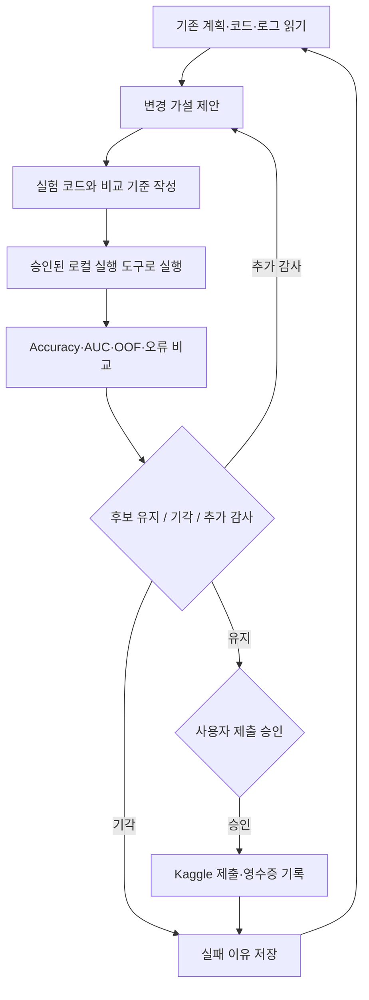

# 04. GPT 웹 세션, 사용자 정의 스킬, 프롬프트의 역할

[프로젝트 홈](../README.md) · [실험 설계](01-experiment-design.md)

## 1. 스킬은 모델 점수를 직접 만드는 피처가 아니었다

이 실험에서 스킬·작업 규약은 “어떤 순서로 확인하고, 어떤 증거를 저장하며, 언제 제출할 것인가”를 구조화하는 역할을 했습니다. 모델 입력에 프롬프트를 숫자로 넣어 학습한 것이 아닙니다. 실제 피처와 예측은 Python 코드와 라이브러리에서 생성됐습니다.

당시 프로젝트에 남은 [agents.md](../archive/session-notes/agents.md)는 plan·discoveries·handoff·README 선독, 버전 식별자 사용, 그룹 타깃 통계의 fold 경계, 제출 검사 같은 규약을 포함합니다. 이것은 사용자 환경에서 사용한 모든 스킬 원문의 완전한 복사본은 아닙니다. 외부 설치 경로의 스킬·인증 파일을 무단으로 공개하지 않았습니다.

## 2. 반복 작업 사이클



이 흐름의 유용한 부분은 중단 후 복구할 수 있는 상태 문서였습니다. 사용자는 “작업이 중단됐다”, “현재 상황을 알려달라”, “계속 진행하라”처럼 짧게 요청했고, GPT는 기존 파일을 읽고 다음 작업을 제안했습니다. 하지만 짧은 요청이 있을 때마다 많은 실험을 추가하다 보니 선택 자유도가 누적되는 문제도 있었습니다.

## 3. 실제 대화에서 사용한 지시의 유형

아래는 이 프로젝트 대화에서 관찰된 짧은 사용자 요청의 예입니다. 완전한 대화 원문이나 정확한 호출 순서 전체를 공개한 것은 아닙니다.

| 요청 예 | 의도 | 실행으로 연결된 일 |
|---|---|---|
| “plan에 적어둬” | 다음 행동을 상태 파일로 남김 | 계획·우선순위 갱신 |
| “완료된 후 개선이 되면 알아서 제출해” | 조건부 외부 제출 승인 | 후보 검증 후 제출과 점수 확인 |
| “개선 할만큼 최대한개선하고 더이상할게 없으면 그때 제출해” | 탐색 후 제출 시점을 미룸 | 추가 모델·검증·앙상블 분기 |
| “왜 실패 했는가?” | 성공 중심 설명을 중단하고 분석 | 불일치·변경 행·검증 가정 점검 |
| “계속 진행해봐” | 이전 계획 재개 | 코드 작성, 실행, 로그 확인 |
| “가능성이 있는것들 제출해봐” | 보류 후보 실제 시험 | 마지막 7건 제출 캠페인 |
| “깃허브 정리하고 마무리하자” | 종료와 공개 정리 | 증거 보존·보고서·차트·재현 검사 |

사용자의 질의는 작업 방향을 바꾸는 중요한 개입이었습니다. 특히 중단 판단 뒤 다시 제출하도록 한 요청이 실제 Public 최고점 갱신으로 이어졌습니다. 이를 사람 없는 자율 성과로 집계하면 실험의 성격이 달라집니다.

## 4. 무엇이 자동화되었나

코드 초안 작성, 반복 설정 실행, 기존 예측 비교, 로그 정리, 제출 CSV 생성, 점수 수집, 문서 갱신이 상당 부분 도구 호출로 수행됐습니다. 반면 과제 선택, 목표 제약, 스킬 설정, 질문을 통한 방향 수정, 제출 승인, 종료 판단은 사용자가 개입했습니다.

GPT 웹 세션은 스스로 지속 실행되는 서비스가 아니었습니다. 실행 명령을 호출한 경우 로컬 프로세스가 돌아갈 수 있지만, 대화가 종료된 뒤 모델이 알아서 다음 가설을 생성하고 이어서 도구를 호출하는 구조는 아닙니다. “계속 진행 중”이라는 상태 보고에는 실제 실행 세션·파일·영수증 확인이 필요합니다.

## 5. 재사용할 수 있는 프롬프트 패턴

다음은 원문 기록이 아니라, 이 사례에서 배운 점을 반영해 **종료 시점에 재구성한 템플릿**입니다.

```text
목표: [지표]를 개선하되, 외부 정답 조회와 검증 라벨 누출을 금지한다.
먼저 plan, handoff, 실험 로그, 현재 champion 파일을 읽어라.
변경은 한 번에 하나의 가설로 제한하고, 기존 기준과 같은 split/model seed에서 비교하라.
전처리와 supervised encoding을 포함한 전체 학습 경계를 명시하라.
OOF, split manifest, 설정, 데이터 지문, 예측 파일 해시를 저장하라.
실패한 후보도 기록하고, 발견용 검증과 최종 검증을 구분하라.
외부 제출은 미리 정한 예산과 승인 범위에서만 수행하라.
확인하지 않은 성능·완료·무누출·원인에 관한 주장을 하지 마라.
```

이 템플릿만으로 동일한 점수나 코드가 재현된다고 보장하지 않습니다. 모델 버전, 도구 권한, 패키지 버전, 공개 자료 접근, 사용자의 후속 개입이 다르면 경로가 달라집니다.

## 6. 추후 같은 실험을 설계한다면

처음부터 스킬 버전과 핵심 프롬프트를 해시로 고정하고, 실험 수와 제출 예산을 사전 등록하며, 전체 selector까지 평가할 외부 holdout을 봉인하는 편이 낫습니다. 스킬 기여를 평가하려면 동일한 데이터·예산·모델 조건에서 no-skills 대조군을 따로 운영해야 합니다. 이번 결과에 그러한 대조군이 있었던 것처럼 설명하지 않습니다.
