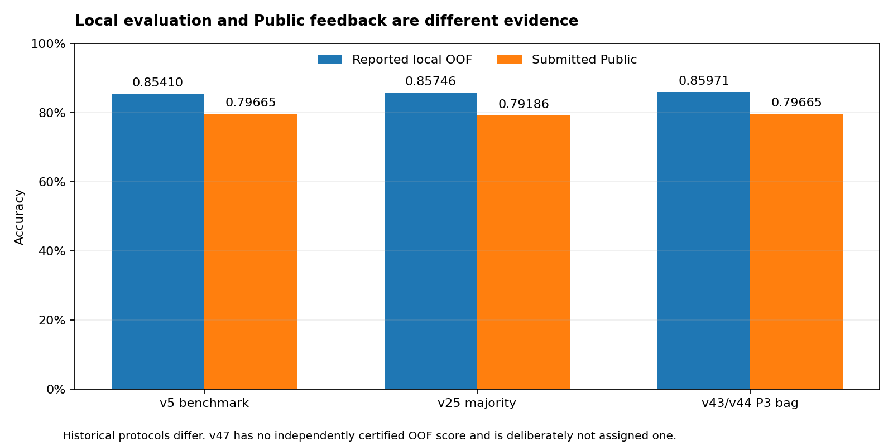

# 06. 결과와 교훈

[프로젝트 홈](../README.md) / [검증과 한계](03-validation-and-integrity.md)

## 점수는 올랐지만 과정은 직선적이지 않았다

실제 Public 최고점은 첫 제출 0.79186에서 v47의 0.83014로 올랐다. [제출 기록](evidence/kaggle-submissions.csv)에 남은 수치다. 그 사이에는 점수가 떨어진 후보가 여럿 있었고, 후반에 만든 복잡한 모델이 최종 제출로 채택된 것도 아니었다.

v5의 OOF는 0.85410, Public은 0.79665였다. v25는 로컬에서 0.85746을 기록했지만 Public은 0.79186이었다. P3 bagged 후보도 보고된 OOF는 0.85971이었으나 실제 제출 Public은 0.79665였다.

각 비교는 학습 크기, 전처리와 예측 결합 방식이 다르다. 차이 전체를 작은 test의 우연이나 과적합 하나로만 설명할 수는 없다. 파일이 실제로 어떤 코드와 입력에서 나왔는지 함께 봐야 했다.

## 검증 횟수가 많다고 독립적인 근거가 많아지는 것은 아니다

Repeated CV는 split에 따른 흔들림을, group split은 새로운 관계 집단에 대한 성능을, pseudo-test는 test와 비슷한 입력 조건을 점검했다. 하지만 모두 같은 학습 데이터에서 출발했다. 동일한 승객의 성공이 여러 split에 반복될 수 있으므로 결과를 독립 표본처럼 합치면 확신을 과대평가할 수 있었다.

모델을 고르는 과정도 문제였다. 같은 검증 결과를 보며 피처와 후보를 여러 번 바꾸면 선택 자체가 그 데이터에 맞춰진다. 나중에 nested CV를 추가해도 이미 같은 데이터에서 발전시킨 가설 전체를 처음 상태로 되돌리지는 못했다.

## 피처가 좋아도 최종 조합은 별도로 확인해야 했다

EB shrinkage나 티켓 P3는 몇몇 로컬 비교에서 개선됐다. 그렇다고 그 피처를 사용하는 모델의 예측을 기존 제출에 그대로 반영할 수는 없었다. 바뀌지 않는 많은 행보다 실제로 바뀌는 소수의 행에서 어느 쪽이 더 정확한지가 중요했다.

마지막에는 기존 v10을 유지하면서 text와 Deotte 여성 예측을 일부 적용한 조합이 더 높은 Public을 기록했다. 그 사실이 모든 데이터에서 규칙 보정이 모델 교체보다 낫다는 뜻은 아니다. 이 제출 표본에서 관찰한 결과로 남겼다.

## 스킬과 프롬프트는 운영에 도움이 되었지만 오류를 없애지는 못했다

작업 규약이 있어 이전 결과를 읽고, 중단 후 복구하고, 예측 파일을 보존하고, 실패한 후보도 기록할 수 있었다. 짧은 요청으로 여러 코드와 평가 자료를 만들 수 있었던 점은 이번 작업의 성과였다.

동시에 과도한 확신과 조기 중단, 평가 조건의 혼동도 있었다. 직접 코드를 읽고 원시 지표를 확인해야 수정할 수 있었다. 생성한 코드의 양보다 그 결과를 검토할 수 있는 기록과 경계가 중요했다.

스킬을 쓰지 않은 같은 조건의 실험은 없다. 따라서 개선 폭을 스킬이나 특정 프롬프트의 기여로 분해하지 않는다. 이번 기록이 보여주는 것은 그 방식으로 어떤 작업을 수행했고 어떤 결과가 나왔는지다.

## 최종 점수를 해석할 때 남는 조건

최종 v47은 공개 방법 재현, 공개 예측 재사용과 Public 결과를 본 뒤의 선택을 포함한다. 검증 라벨이 들어간 역사적 CV 결과도 별도로 존재한다. 그래서 0.83014를 공식 train만으로 학습한 독립적인 무누출 일반화 성능으로 설명하지 않는다.

후속 실험에서는 공식 train만 쓰는 분기와 외부 자료를 쓰는 분기를 처음부터 나누고, 마지막까지 선택에 사용하지 않을 평가를 정해야 한다. 전처리와 타깃 통계, 모델 선택까지 같은 경계 안에서 실행하고, 모델 seed를 맞춘 비교와 그룹 단위 불확실성 평가를 추가하는 것이 우선이다.

이번 작업은 이 상태에서 종료했다. 데이터와 코드를 보존하고, 확인한 수치와 구현상의 제한을 함께 남기는 것으로 마무리했다.
